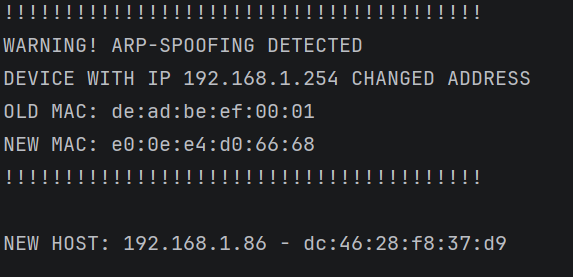

# ARP Spoofing Detector

A lightweight Python script designed to passively monitor local network traffic and detect potential ARP spoofing (man-in-the-middle) attacks using the Scapy library.

## How It Works
The script captures local ARP packets and builds an in-memory IP-to-MAC address resolution table (`mac_table`). If an existing IP address suddenly broadcasts a different MAC address, the script triggers an immediate security alert in the console.

## Features
- Passive network analysis (does not flood the network with requests).
- Real-time alerts upon MAC address modification.
- Prints the compiled IP/MAC map on exit.

## Screenshot Demo
When an ARP spoofing anomaly occurs, the script instantly highlights the attack details:

## Requirements
- Python 3.x
- **Windows**: Npcap installer (with "WinPcap API-compatible mode" enabled)
- **Linux**: Root privileges (required for raw socket sniffing)
